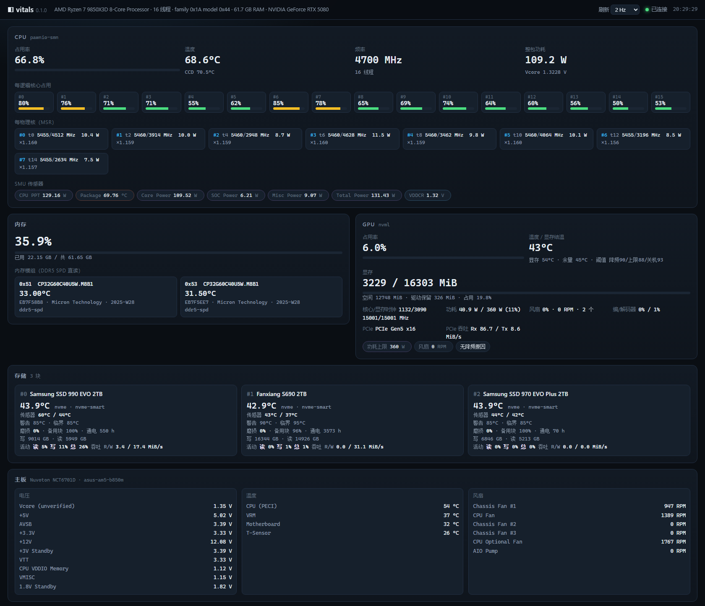

# computer-status

实时展示 CPU / 内存 / GPU / 显存占用与温度的小工具。前后端分离：核心是 **Rust 编译的动态库 `cs_core.dll`（C ABI）**，展示层只是它的消费者，随时可换 —— 仓库里自带两个展示层样例：终端面板 `cs-cli.exe` 与网页 `web/`。

```
┌──────────────────────────┐      C ABI (JSON in/out)     ┌──────────────────────┐
│  cs_core.dll (Rust)      │ ◄──────────────────────────► │  展示层（可整体替换）  │
│  采样线程 500ms 一帧      │   cs_init / cs_get_metrics   │  CLI  cs-cli.exe   ✓ │
│  温度/功耗多源降级链       │   cs_get_info / cs_shutdown  │  Web  web/(FastAPI)✓ │
└──────────────────────────┘                              └──────────────────────┘
```



## 快速开始

```powershell
cargo build --release          # 产物: target\release\cs_core.dll + cs-cli.exe
.\target\release\cs-cli.exe            # 单帧面板
.\target\release\cs-cli.exe --watch    # 持续刷新 (Ctrl+C 退出)
.\target\release\cs-cli.exe --jsonl    # 每帧一行 JSON（喂管道/其他工具）
.\target\release\cs-cli.exe --info     # 硬件静态信息 + 数据源诊断
```

国内网络拉依赖（crates.io 直连失败时）：

```powershell
cargo --config 'source.crates-io.replace-with="rsproxy-sparse"' `
      --config 'source.rsproxy-sparse.registry="sparse+https://rsproxy.cn/index/"' `
      build --release
```

## Web 壳（`web/`，网页展示层）

```powershell
# 1) 先构建核心（Web 壳只是消费者，不重新实现任何采集）
cargo build --release

# 2) 装依赖（FastAPI + uvicorn[standard]，后者带 websockets）
python -m pip install -r web\requirements.txt
#    国内镜像： python -m pip install -i https://pypi.tuna.tsinghua.edu.cn/simple -r web\requirements.txt

# 3) 起服务（默认 127.0.0.1:8787，然后浏览器打开 http://127.0.0.1:8787/）
python web\server.py
.\web\run.ps1               # 等价启动器：自动找 Python、校验 DLL；-Install 装依赖、-Bind 0.0.0.0 开监听
#    想要温度 / 电压 / SPD / 每核数据，用「管理员」终端跑同一条命令

# 4) 另开一个终端做端到端自检（HTTP + WebSocket，12 项）
python web\smoke_test.py
```

| 接口 | 说明 |
|---|---|
| `GET /` | 单页面板（`web/static/`，无构建步骤、无 npm） |
| `GET /api/info` | 硬件静态信息 + 11 个数据源可用性 |
| `GET /api/metrics` | 最新一帧指标（一次性抓取，换展示层时最省事的入口） |
| `GET /api/health` | 存活 + DLL 路径 + 版本 + 运行时长 |
| `GET /api/contract` | 数据契约速查（纯文本，前端不用翻 Rust 源码） |
| `WS /ws?interval=0.5` | 推送帧；客户端可回 `{"cmd":"interval","value":1}` / `{"cmd":"info"}` / `{"cmd":"ping"}` |

Web 壳只做三件事：**用 ctypes 调 6 个 C ABI 函数**、**把 JSON 原样转发**、**渲染**。它不读硬件、不做单位换算、不做降级判断，因此整层换掉（Vue/React/Qt/另一个语言）都不影响核心。

- 时间基由 DLL 决定：核心内部 500 ms 一帧，前端周期设得再密也只是重复读同一份快照（相邻帧 `ts_ms` 会相同），不会加重硬件负担。
- 面板按数据源可用性自适应：非提权时缺的那几块画成 `n/a` 并给一行原因（页面顶部 banner + 每张卡片的提示），不会假装有数据。
- `scripts/elev-web.ps1` 一次 UAC 跑完整验证：起服务 → 自检 → 落盘 `web-info.json` / `web-metrics.json` / 整页截图到 `%TEMP%\cs-elev\`。
- 面板**没有鉴权**，默认只绑 `127.0.0.1`；要局域网访问请自行加认证。

## C ABI（给任何宿主语言用）

```c
int      cs_init();                 // 初始化（幂等），0 = 成功
const char* cs_version();           // 静态字符串，无需释放
char*    cs_get_info_json();        // 硬件静态信息 JSON，用完 cs_free_string
char*    cs_get_metrics_json();     // 最新一帧指标 JSON，用完 cs_free_string
void     cs_free_string(char* p);
void     cs_shutdown();
```

Python ctypes 最小示例（`web/server.py` 就是这么接的）：

```python
import ctypes, json
dll = ctypes.CDLL(r"target\release\cs_core.dll")
dll.cs_init.restype = ctypes.c_int
dll.cs_get_metrics_json.restype = ctypes.c_void_p      # 用 void_p 拿指针才能释放
dll.cs_free_string.argtypes = [ctypes.c_void_p]
dll.cs_init()
ptr = dll.cs_get_metrics_json()
m = json.loads(ctypes.string_at(ptr).decode("utf-8"))  # string_at 是拷贝，之后才能释放
dll.cs_free_string(ptr)
```

> `restype = c_char_p` 看起来更方便，但 Python 会把返回值直接转成 `bytes`、丢掉指针，再想 `cs_free_string` 就没得传了 —— 所以一律 `c_void_p` + `string_at`。

## 数据源与降级链

| 指标 | 首选 | 降级 | 兜底 |
|---|---|---|---|
| CPU 温度/CCD/功耗 (AMD Zen) | 自研 PawnIO + SMN/MSR（LHM 同源算法） | WMI ACPI 热区 | `null`（诚实报 n/a） |
| CPU 电压/分项功率 (Zen4/5) | SMU PM 表（`RyzenSMU.bin`） | SVI2 电压（Zen4/5 上 LHM 已主动放弃，不移植） | `null` |
| 每核时钟/有效频率/每核功耗 (AMD) | MSR 直读（`HW_PSTATE_STATUS` / `APERF`+`MPERF` / `CORE_ENERGY_STAT`） | — | 不输出 |
| NVMe 温度/磨损/写入量 | `StorageDeviceTemperatureProperty`(52) + `StorageDeviceProtocolSpecificProperty`(50) 读 SMART 健康日志 | 只报盘名（`source:"none"`） | — |
| 磁盘活动率/吞吐 | `IOCTL_DISK_PERFORMANCE` 计数器差分（`DISK_PERFORMANCE`） | NVMe 设备计数器（Data Units 差分，5 s 区间平均） | 不输出 |
| 主板风扇/板温/各路电压 | 自研 PawnIO + SuperIO（`LpcIO.bin`，NCT6701D bank 协议） | 识别芯片名但不解码 | 不输出 |
| 内存温度/型号/序列号 (DDR5) | 自研 PawnIO + PIIX4 SMBus 直读 SPD5 hub（`SmbusPIIX4.bin`） | 识别不到从机则整条不输出（`source:"none"`） | — |
| CPU 占用/频率/内存 | sysinfo | — | — |
| GPU 占用/显存/温度/功耗/风扇 | NVML（进程内, 0 开销） | nvidia-smi 子进程 | `null` |
| GPU 时钟/功耗上限/PCIe 吞吐/编解码器/温度余量 | NVML（进程内） | nvidia-smi 子进程 | 不输出 |
| GPU 显存结温 | NVAPI `NvAPI_GPU_GetThermalSensors`（进程内，0 开销、不需提权） | 无 | `null` |
| GPU 热点 | NVAPI 同结构（RTX 50 系没有这一路 → 恒 `null`） | 无 | `null` |

- **存储 SMART 不需要管理员权限**：`IOCTL_STORAGE_QUERY_PROPERTY` 是 `FILE_ANY_ACCESS`，非提权句柄（`FILE_READ_ATTRIBUTES`）即可读全部 NVMe SMART 字段。**磁盘活动率同样不需要管理员**（见下）。
- **CPU 温度需要管理员权限**：PawnIO 驱动设备（`\\?\GLOBALROOT\Device\PawnIO`）只对管理员开放，非提权时 `Info.sources.pawnio_access_denied = true`，CLI 面板会打一行提示。右键“以管理员身份运行”即可解锁温度/CCD/整包功耗。
- PawnIO 是正规签名驱动（namazso，HVCI 兼容，不在微软黑名单），本机已装 v2.1.0。模块 `drivers/pawnio/AMDFamily17.bin` 为 LHM 官方签发字节码（MPL-2.0，见 COPYING）。
- 与 LHM/FanControl 共享 `Global\Access_PCI` 全局互斥锁，可同时运行互不踩踏。
- RAPL 能量单位：`MSR_PWR_UNIT(0xC0010299)[12:8] = ESU`，**单位是 1/2^ESU 焦耳**（不是微焦——LHM 源码此处注释有误导，其代码本身按焦耳算才是对的），故 `W = Δcounts × 2^-ESU ÷ Δt`。本机 ESU=16。
- **SMU PM 表**（电压/分项功率）：走 `RyzenSMU.bin` 的 `ioctl_resolve_pm_table` / `ioctl_read_pm_table`，同样是**提权**能力。本机固件 PM 表版本 `0x00620105` 连 LHM master 与 `ryzen_smu` 都未收录，我们按“只收编能与独立真值对拍上的字段”实测逆向出一个 Zen5 子集（详见 `PORTING.md`）。
- **主板 SuperIO**（风扇/板温/电压）：走 `LpcIO.bin`，机制完全移植自 LHM 的 `LpcIO.cs` / `LpcPort.cs` / `Nct677X.cs` —— 在配置端口 `0x2E` 进入配置空间读芯片 ID（`0x20`/`0x21`）与运行时基址（`0x60`，非法时退 `0x64`），再按 bank 协议读运行时寄存器（`base+5` 写 `0x4E`、`base+6` 写 bank、`base+5` 写寄存器号、读 `base+6`）。同样是**提权**能力，读之前持有 `Global\Access_ISABUS.HTP.Method` 与 LHM/FanControl 串行化。
  - 风扇解码 `count = (high<<5)|(low&0x1F)`；`>= 0x1FFF` 视为停转（0 RPM），`< 0x15` 视为测不准（不输出），其余 `1.35e6/count`。
  - 电压原始值 `0.008 × 寄存器值`，再按 `Vout = v + (v - Vf) × Ri / Rf` 还原分压。
  - 温度按 LHM 的 `DecodeNct6701Temperature`：`0x00`/`0xA0`/`0x7E..0x80` 是「无传感器」哨兵，其余按有符号字节（**不做 0.5 细分**，与 NCT679x 路径不同）。
- **内存 SPD**（DDR5 温度/型号/序列号）：LHM 自己**不实现** SPD 读取，而是把整件事委托给 NuGet 库 RAMSPDToolkit；我们按它的等价机制自己实现（`crates/core/src/smbus.rs` 传输层 + `crates/core/src/spd.rs` 解码），走 AMD FCH 的 PIIX4 兼容控制器（`SmbusPIIX4.bin`）。同样是**提权**能力，读之前持有 `Global\Access_SMBUS.HTP.Method`。
  - **两套地址空间靠 bit7 区分**（最容易搞错的一点）：`command = 0x00..0x7F` 是 SPD5 hub 的 **MR 寄存器**（设备类型、页寄存器、温度、状态、能力位），`command = (offset & 0x7F) | 0x80` 是 **EEPROM 页数据**。子 agent 读源码时把「`IsAvailable` 不置 bit7、`At()` 置 bit7」列为疑点，实测证明两者本就该不同。
  - **页切换**：DDR5 没有 DDR4 的 `0x36+page` 伪从机，页号写在 **MR11（`0x0B`）低 3 位**，写后作用于 `|0x80` 空间；`At(addr)` 换算 `page = addr >> 7`、`offset = (addr & 0x7F) | 0x80`（型号/序列号在第 4 页）。
  - **温度**：MR 空间偏移 `0x31`、16 位小端、**不交换字节、不做 RawTemperatureAdjust**，且必须先归零页；换算 `0.0625 °C/LSB`，bit12 为符号位（置位时 `(raw & ~0x1000) × 0.0625 − 256`）。
  - **厂商名**：JEP106 延续码清掉 bit7 后 **加 1** 才是厂商表的 bank（`SPDAccessor.cs:344` 的 `continuation + 1`）；本机延续码读出 `0x80` → bank 1 + ID `0x2C` = Micron。
  - 身份字段是静态的，只在启动时读一次 EEPROM；采样循环每 5 s 只重读 2 次字读 + 1 次字节读（温度/状态）。
- **每核时钟/功耗（MSR）**：三条通路都移植自 LHM 的 `Amd17Cpu.Core` / `CpuThread`，同样是**提权**能力（PawnIO 的 `ioctl_read_msr`）。
  - **读之前必须把线程钉到目标核**（`cpu_topology::Affinity`，底层 `SetThreadAffinityMask`）—— AMD 的 APERF/MPERF、`CORE_ENERGY_STAT`、`HW_PSTATE_STATUS` 都是**每核寄存器**，`rdmsr` 读到的是当前线程所在核的值。物理核→逻辑处理器分组用 `GetLogicalProcessorInformationEx(RelationProcessorCore)` 问系统，**不假设 i / i+8**（本机实测是 (0,1)(2,3)…(14,15)，SMT 兄弟相邻）。
  - **瞬时频率** = `MSR 0xC0010293` 的 `CpuFid[11:0] × 5 MHz`（Zen5；Zen1~4 走 `CpuFid[7:0] / CpuDfsId[13:8] × 200`）。
  - **有效频率** = `APERF(0xC00000E8)` 增量 ÷ 采样窗口（µs）。APERF 只在实际执行时计数，所以摊到墙钟时间得到的是「平均值」，空载核会显著低于瞬时频率 —— 与 LHM 的 `Core #N (Effective)` 同语义。
  - **每核功耗** = `CORE_ENERGY_STAT(0xC001029A)` 差分 × 能量单位 ÷ 时间；能量单位与整包 RAPL 共用 `MSR_PWR_UNIT`。
  - 计数器倒挂（回绕）或跳变 > 20000e6 时**丢弃该轮并重建基线**，而不是算出一个负频率（LHM 同样处理）。
- **GPU（NVML）**：LHM 的 GPU 传感器其实大半不在 NVML 上（时钟走 NVAPI，热点/显存结温也走 NVAPI 的 `NvAPI_GPU_GetThermalSensors`，PawnIO 的 `Nvidia.bin` 是它另挂的补充通路），我们从 NVML 直接取等价信息，**全部字段先用 `examples/nvml_probe.rs` 在本机取到真值再收编**，并用 `nvidia-smi`（完全独立的另一条通路）逐字段对拍。
  - **显存口径**：`nvmlMemory_t`（v1）的字段顺序是 `{ total, free, used }`，**没有 reserved**；`nvmlMemory_v2_t` 才是 `{ version, total, reserved, free, used }`，其中 `used` 不含驱动保留。优先用 v2，v1 只兜底且**直接用它的 `used` 字段**。这里曾有一个真 bug（见「已知边界」）。
  - **PCIe 计数器顺序反直觉**：`nvmlPcieUtilCounter_t` 是 `TX_BYTES = 0, RX_BYTES = 1`；返回单位 KB/s，本项目换成 MiB/s 输出。
  - **温度余量**（`nvmlDeviceGetMarginTemperature`，R560+ 新 API）= 离最近一个降频阈值还差多少度，本机实测 32~35 °C（当前 54~55 °C，slowdown 阈值 90 °C）—— 与 `nvmlDeviceGetTemperatureThreshold` 独立读出的阈值互相印证。
  - **限频原因**用 `nvmlDeviceGetCurrentClocksThrottleReasons` 的位掩码按 `nvml.h` 的 `nvmlClocksEventReason*` 位表解码成中文标签；未定义的位打印成 `未知位(0x..)` 而不是静默丢弃（谁的位表旧一眼可见）。
  - 降级链（`nvidia-smi`）能补上同样的时钟/上限/PCIe 链路/编解码器/限频位掩码，补不上的是温度余量、风扇 RPM、PCIe 吞吐速率与显存 reserved —— 那些字段在降级路径下保持 `null`。
- **GPU 显存结温（NVAPI）**：NVML 在 N 卡消费级上给不出显存结温，LHM 走的是 NVAPI 的 `NvAPI_GPU_GetThermalSensors`（本模块照抄这一路），面板上的 `MEMJ` 就从这来。
  - **通道掩码不是有效性**：`NvThermalSensors.Mask` 表示「我可以请求哪几号通道」，掩码发现照抄 LHM —— 从 `1<<0` 逐位试着请求，**第一个失败的位减一就是掩码**（本机 = bit 19 失败 → `0x0007FFFF`，19 路）。掩码为 0 时两个版本的调用都返回 `-121`。
  - **有效性看哨兵**：每路读回来是 8.8 定点，`0xFF00`（= 255.00 °C）是「无此传感器」的哨兵。判 `raw == 0xFF00 || raw <= 0` 才认无效，不能只看掩码 —— 本机 19 路里有 17 路是哨兵。
  - **型号决定通道号**：镜头核心温度与显存结温的通道号按代际不同（照抄 LHM）：`RTX 50xx` → `[1]` 核心温度、`[2]` 显存结温（**没有独立热点通道**）；`RTX 40xx` → `[1]` 热点、`[7]` 结温；其余 → `[1]` 热点、`[9]` 结温。版本字是 `sizeof(结构) | (版本 << 16)`，本结构 168 字节 → `0x000200A8`。
  - **多 GPU 直接放弃**：`NvapiGpu::open()` 在物理 GPU 数 != 1 时返回 `None`（不做 bus id 配对）—— 宁可不输出，也不冒认错卡的风险。
- **磁盘活动率/吞吐（`DISK_PERFORMANCE`）**：对应 LHM `StorageDevice.cs:396-447` 的 `_perfRead/_perfWrite/_perfTotal`，**不需要管理员权限**（`FILE_READ_ATTRIBUTES` 句柄即可，与 SMART 同级）。
  - **IOCTL 码值必须用新版 winioctl.h 的编码**：`CTL_CODE(IOCTL_DISK_BASE, 0x0008, METHOD_BUFFERED, **FILE_ANY_ACCESS**)` = `0x00070020`。旧文档/老头文件写的是 `FILE_READ_ACCESS` → `0x00074020`，本机把这个值发给驱动会一律返回 `ERROR_INVALID_FUNCTION(1)`（驱动按编译时的宏做全值比较）。代码两个码值都试，取先成功的，并记录生效码值。
  - **活动率** = `ΔReadTime / ΔQueryTime`（读）与 `ΔWriteTime / ΔQueryTime`（写），总活动率 = `100 − ΔIdleTime / ΔQueryTime`，都钳到 `0..=100`。
  - **速率必须用墙钟做分母**：`QueryTime` 只在驱动刷新计数器时才走（本机空闲时 2 s 只走约 50 ms），LHM 用 `ΔQueryTime` 当时间基，空闲时会算歪；本项目用 `Instant` 墙钟间隔。
  - **第二条吞吐通路**：NVMe SMART 健康日志里的 `Data Units Read/Written`（1 单位 = 512000 B）差分，粒度 = 健康日志刷新间隔（本项目 5 s），仅在 IOCTL 通路不通时启用（面板上带 `avg5s ` 前缀）。
  - 计数器的进程句柄不必常驻：它们都是**设备级累加值**，每次采样开-查-关即可。

## 本机实测（9850X3D + RTX 5080）

非提权（`cs-cli.exe`）：

```
CPU     AMD Ryzen 7 9850X3D 8-Core Processor usage  46.8%   4700 MHz    n/a
        ! CPU 温度/功耗/每核时钟需要管理员权限（PawnIO 设备只对管理员开放）
CORES   ██████▌··· █████▌···· ...（16 逻辑核）
MEM      24.3 /  61.7 GB  ( 39.4%)
GPU     NVIDIA GeForce RTX 5080      usage  49.0%    6246/16303  MiB ( 38.3%)   55.0°C   163.6 W  fan  41%
        CLK Core 2872/3090MHz  Mem 15001/15001MHz   LIMIT 360W (45%)   TEMP margin 32°C   MEMJ 66°C   THRESH slowdown 90 / max 88 / shutdown 93   FAN 1039RPM x2
        PCIe Gen5 x16   Rx 1934 Tx 173 MiB/s   VRAM free 9731 reserved 326 MiB   ENC 0%  DEC 4%
DISK0   Samsung SSD 990 EVO 2TB       53.9°C  wear   0%  wrote    8939 GB     541 h
        act R  0% W  1% T  1%   0.0/8.7 MiB/s   sensors 66°C   warn 85°C   crit 85°C
DISK1   Fanxiang S690 2TB             43.9°C  wear   0%  wrote   16337 GB    3564 h
        act R  0% W  0% T  0%   0.1/0.0 MiB/s   warn 90°C   crit 95°C
DISK2   Samsung SSD 970 EVO Plus 2TB  53.9°C  wear   0%  wrote    6844 GB      69 h
        act R  0% W  0% T  0%   0.0/0.0 MiB/s   sensors 49°C   warn 85°C   crit 85°C
        ! 主板 SuperIO（风扇/板温/电压）需要管理员权限
        ! 内存 SPD 温度（DDR5）需要管理员权限
```

提权后（`scripts\elev-verify.ps1`，经 UAC 一次确认）——CPU 温度/CCD/整包功耗 + SMU 电压/分项功率 + 主板 SuperIO 风扇/板温/电压 + 三盘 SMART 全部解锁：

```
CPU     AMD Ryzen 7 9850X3D 8-Core Processor usage   5.0%   4700 MHz   50.1°C   28.3 W
CORES   █████▌··· ...
CCD     34.0°C  (pawnio-smn)
VOLT    Core 1.3970 V   SoC n/a
SMU     CPU PPT 39.0W  Package 45.5°C  Core Power 18.6W  SOC Power 5.8W  Misc Power 8.8W  Total Power 39.0W
MEM      18.9 /  61.7 GB  ( 30.7%)
GPU     NVIDIA GeForce RTX 5080      usage  49.0%    6246/16303  MiB ( 38.3%)   55.0°C   163.6 W  fan  41%
        CLK Core 2872/3090MHz  Mem 15001/15001MHz   LIMIT 360W (45%)   TEMP margin 32°C   MEMJ 66°C   THRESH slowdown 90 / max 88 / shutdown 93   FAN 1039RPM x2
        PCIe Gen5 x16   Rx 1934 Tx 173 MiB/s   VRAM free 9731 reserved 326 MiB   ENC 0%  DEC 4%
DISK0   Samsung SSD 990 EVO 2TB       45.9°C  wear   0%  wrote    8965 GB     547 h
        act R  0% W  0% T  0%   0.0/0.0 MiB/s   sensors 65°C   warn 85°C   crit 85°C
DISK1   Fanxiang S690 2TB             42.9°C  wear   0%  wrote   16341 GB    3570 h
        act R  0% W  0% T  0%   0.1/0.0 MiB/s   sensors 42°C   warn 90°C   crit 95°C
DISK2   Samsung SSD 970 EVO Plus 2TB  45.9°C  wear   0%  wrote    6845 GB      70 h
        act R  0% W  0% T  0%   0.0/0.0 MiB/s   sensors 50°C   warn 85°C   crit 85°C
BOARD   Nuvoton NCT6701D  (asus-am5-b850m)
FAN     Chassis Fan #1 805RPM  CPU Fan 1017RPM  Chassis Fan #2 0RPM  Chassis Fan #3 0RPM  CPU Optional Fan 1202RPM  AIO Pump 0RPM
VOLT    Vcore (unverified) 1.33V  +5V 5.02V  AVSB 3.39V  +3.3V 3.33V  +12V 12.08V  +3V Standby 3.39V  VTT 3.33V  CPU VDDIO Memory 1.12V  VMISC 1.14V  1.8V Standby 1.82V
TEMP    CPU (PECI) 38°C  VRM 34°C  Motherboard 34°C  T-Sensor 26°C
DIMM    0x51  CP32G60C40U5W.M8B1     EB7F58B8  34.0°C  Micron Technology
DIMM    0x53  CP32G60C40U5W.M8B1     EB7F5EE7  32.2°C  Micron Technology
CORE    #0  5510/ 4310MHz  10.2W  #1  5510/ 3208MHz   9.1W  #2  5515/ 2165MHz   7.9W  #3  5515/ 3556MHz  10.0W
        #4  5515/ 2522MHz   8.1W  #5  5515/ 2873MHz   8.6W  #6  5515/ 2429MHz   7.4W  #7  5515/ 1426MHz   6.5W
```

> `CORE` 行的格式是 `#核号 瞬时频率/有效频率 MHz  每核功耗 W`。本机这一帧 8 个核的瞬时频率几乎相同（都停在 P0 档），真正逐核变化的只有**有效频率**；语义说明见「已知边界」。
>
> 上面提权样例里的 GPU 三行取自同一次非提权采样（NVML 不要求提权，两种权限下输出完全相同），把它当成提权面板里 GPU 段的形态即可。

> 上例是用 `*> file` 重定向抓的，读文件时要按 **UTF-8** 打开：编码猜成 GBK 会把 `█` 的尾字节和后面的换行吞掉，看起来像 MEM 行和 GPU 行粘在一起（且中文变 `鎵撳紑`），实际输出没这个问题。

SMU PM 表与 SMN/MSR 是两条完全独立的通路，互相印证说明下标选对了：同一帧内 **`Package` 与 SMN 的 `CCD` 同量级**（45.5 / 34.0，负载时曾实测 66.8 / 66.8 相等）、**`CPU PPT` 与 RAPL 整包功耗同量级**（39.0 / 28.3 W，负载时可到 101 / 95 W）。

主板 SuperIO 一侧的读数经**标称值与行为**双重核对：+12 V / +5 V / +3.3 V / +3 V Standby / 1.8 V Standby 五路全部落在标称值上，风扇 RPM 随负载变化（CPU Fan 1017→1236，Chassis Fan #1 805→990）。

内存 SPD 读数与 **WMI/SMBIOS 这个完全独立的来源**逐字段对上（`Get-CimInstance Win32_PhysicalMemory`）：两条模组的 `PartNumber = CP32G60C40U5W.M8B1`、`SerialNumber = EB7F58B8` / `EB7F5EE7` 与 SPD 解出的字符串**完全一致**，厂商 `Micron Technology` 与 WMI 的 `Micron` 一致，温度 34.0 / 32.2 °C。

每核功耗则形成一条**三源互证链**（同一帧）：`各核 CORE_ENERGY_STAT 之和` ≤ `SMU PM 表 Core Power` ≤ `RAPL 整包功耗` —— 实测 67.8 W ≤ 78.3 W ≤ 97.1 W，三条通路分别来自每核 MSR、SMU 固件遥测、整包 RAPL 计数器，排序与量级都自洽。

GPU 一栏用 **NVML 与 nvidia-smi 两条通路逐字段对拍**（`examples/gpu_probe.exe`，14 个字段：显存 used/total/free/reserved、温度、功耗、功耗上限、风扇、核心/显存时钟、编解码器、PCIe 链路、限频位掩码），本机实测**差值最大 1 MiB、0 项不一致**；其中功耗另有一条独立校验——`nvmlDeviceGetTotalEnergyConsumption` 的 1 秒差分（195.2 W）与瞬时功耗（194.4 W）吻合。

GPU 的**核心温度**同样对拍过：NVAPI 的 `Temperatures[1]`（本机 = 核心温度）读到 59.97 °C，同帧 NVML 读 60.00 °C，**差 0.03 °C**。

显存结温走的是**第三条完全独立的通路**（`examples/nvidia_pawnio_probe.exe`，提权跑）：NVAPI 的 `Temperatures[2]` = **66.00 °C**，而 PawnIO `Nvidia.bin` 直接读 GPU 的 48 路内存热传感器（`ioctl_read_memory_temperatures`，本机 8 路有效）得到 62/64/64/62/**66**/64/64/62 —— **最大值 66 °C 与 NVAPI 精确相等**。一条是进程内 NVAPI 调用，一条是 PawnIO 直接读 MMIO 寄存器，代码路径与数据来源都不共享，这个吻合才叫验证。

磁盘吞吐同样有**三条互不共享的通路**（`examples/diskperf_probe.exe` 的非缓冲 512 MiB 写/读自证）：

| 阶段 | 文件级 Stopwatch | IOCTL `ΔBytesWritten/Read` | NVMe 设备计数器 `Data Units` |
|---|---|---|---|
| 写 512 MiB | 3262.1 MiB/s | 3279.5 MiB/s（差 0.5%） | 3328.8 MiB/s |
| 读 512 MiB | 2705.6 MiB/s | 2704.4 MiB/s（差 0.04%） | 2706.7 MiB/s |

同一阶段只有承载测试文件的 **DISK0** 有增量（DISK1/2 全 0），说明按盘归因正确；活动率也符合物理直觉——写阶段 `W82.4% R6.1% T85.7%`、读阶段 `R95.4% W0.0% T90.5%`。这三条通路**非提权就能跑**。

## 结构

```
crates/core/          # cs_core.dll：采样引擎 + C ABI
  src/lib.rs          # Monitor 状态机 + 后台采样线程 + ABI 导出
  src/pawnio.rs       # PawnIO 驱动客户端（IOCTL 装载/执行签名字节码）
  src/amd_temp.rs     # AMD Zen 温度/功耗/每核时钟纯数学（SMN/MSR 解码，单测覆盖）
  src/cpu_topology.rs # 物理核→逻辑处理器拓扑 + 线程亲和性守卫（每核 MSR 的前置条件）
  src/wmi_temp.rs     # 手写 COM/WMI 兜底（windows-sys 无经典 WMI 接口）
  src/gpu.rs          # NVML（libloading）+ nvidia-smi 降级（显存/时钟/功耗上限/PCIe/编解码器/限频原因）
  src/nvapi.rs        # NVAPI 补充通道（显存结温/热点；掩码发现 + 8.8 定点哨兵解码）
  src/storage.rs      # NVMe SMART + 磁盘活动率/吞吐（IOCTL_DISK_PERFORMANCE / 设备计数器，纯解析函数单测覆盖）
  src/smu.rs          # SMU PM 表（Zen4 用 LHM 布局；Zen5 0x620105 为实测逆向子集）
  src/superio.rs      # 主板 SuperIO（NCT6701D bank 协议 + 主板档案命名，纯解码函数单测覆盖）
  src/smbus.rs        # PIIX4 SMBus 传输层（SmbusPIIX4.bin，errno 映射，逐字块读）
  src/spd.rs          # DDR5 SPD 解码（MR/EEPROM 双地址空间、页切换、温度、型号/序列号）
  src/schema.rs       # JSON 契约（展示层唯一依赖的东西）
  examples/*.rs       # 探针：temp_probe / gpu_probe（NVML↔nvidia-smi 两路对拍）/ nvml_probe（符号能力矩阵）
                      #       / nvapi_probe（NVAPI 热通道与时钟）/ nvidia_pawnio_probe（PawnIO 内存热传感器对拍，提权）
                      #       / wmi_probe / storage_probe / diskperf_probe（512 MiB 非缓冲写读 → 三条吞吐通路自证）
                      #       / smu_probe / superio_probe / smbus_probe / spd_probe / msr_probe
crates/cli/           # cs-cli.exe：面板/JSONL/--info，展示层参考实现（终端）
web/                  # 网页展示层（Python FastAPI + ctypes 调 cs_core.dll）
  server.py           #   C ABI 绑定 + /api/* + WebSocket 推送 + --once 自检模式
  smoke_test.py       #   端到端自检：HTTP 契约校验 + WebSocket 往返 + 指令通道（12 项）
  run.ps1             #   启动器：找 Python、校验 DLL、-Install 装依赖、起服务
  requirements.txt    #   fastapi + uvicorn[standard]
  static/             #   index.html + app.js + style.css（无构建步骤、无 npm）
docs/web-dashboard.png # 提权实测的整页面板截图（README 用图）
drivers/pawnio/       # 签名字节码模块 + MPL-2.0 COPYING
scripts/elev-verify.ps1  # 一次 UAC 提权验证（CPU 温度/功耗 + SMU + SuperIO + 存储 SMART）
scripts/elev-smu.ps1     # 只跑 SMU 探针（逆向 PM 表时用）
scripts/elev-superio.ps1 # 只跑 SuperIO 探针（bank 全转储，逆向主板寄存器时用）
scripts/elev-smbus.ps1   # 只跑 SMBus 传输层探针（SPD 从机扫描/双寻址/页切换）
scripts/elev-spd.ps1     # 内存 SPD 专项验证（寄存器 + EEPROM 转储 + 面板 + JSONL 帧）
scripts/elev-msr.ps1     # 只跑每核 MSR 探针（拓扑 / P-state / APERF / 每核功耗）
scripts/elev-nvidia.ps1  # 只跑 PawnIO GPU 热传感器探针（显存结温的第二条通路）
scripts/elev-diskperf.ps1 # 只跑磁盘活动率/吞吐探针（非缓冲 512 MiB 写读 + 三条通路对拍；不提权也能跑）
scripts/elev-web.ps1     # 提权端到端验证 Web 壳（起服务 + 自检 + info/metrics JSON + 整页截图）
.ref/                 # 参考源码（只读，不参与构建）
```

### 构建注意

`cargo build --release --examples` 是**目标过滤器**，只建 lib + examples，**不会重链 `cs-cli.exe`**；改完核心代码后要跑 `cargo build --release`（不带 `--examples`）才会更新 CLI 二进制。`cargo test` 同样不重链该 exe。

## 已知边界

- **GPU 显存曾经算错，现已修正**：早期版本的 `nvmlMemory_t` 布局写成了 `{ total, reserved, free }`（实际是 `{ total, free, used }`），于是 `used = total - free` 算出来的是**剩余显存** —— 16 GB 卡空载显示 "13293/16303 MiB (81.5%)" 就是这个原因。现在优先走 `nvmlMemory_v2`（显式 `used`/`reserved`），v1 兜底也直接用它的 `used`。修正后与 nvidia-smi 一致（本机同刻 6246 / 16303 MiB，free 9731 / reserved 326 MiB）。**「单次吻合不算验证」这条教训在这里再次生效：发现靠的是与 nvidia-smi 逐字段对拍，而不是看数字顺不顺眼。**
- **GPU 热点温度与显存结温，NVML 一侧确实拿不到（结温已由 NVAPI 补上，见下一条）**：`nvmlDeviceGetTemperature` 只有 sensor 0（die）有效，sensor 1（`GPU_MAX`）返回 `NVML_ERROR_INVALID_ARGUMENT`；`nvmlDeviceGetMemoryTemp` 符号在本机 nvml.dll 里不存在；`nvmlDeviceGetThermalSettings` 虽然可用，但实测 `count = 1`（controller = GPU_INTERNAL，就是 die 温度本身，`currentTemp` 与 sensor 0 相同）；`nvidia-smi dmon -s p` 的 `mtemp` 列也是 `-`。这四项证据说明 NVML 这条路上没有第二路温度，所以另外接了 NVAPI。
- **RTX 50 系没有「热点」这个传感器，`hotspot_c` 恒为 `null` 是事实而不是缺陷**：NVAPI 的 32 路里只有 `[1]`（核心温度）与 `[2]`（显存结温）有效，其余 17 路是 `0xFF00` 哨兵；LHM 对 `RTX 50xx` 也是**显式把 hotspot 传感器置 0**（`_hotSpotTemperature.Value = 0`）、只取 `[1]`/`[2]`，本项目与之一致。PawnIO 的 `Nvidia.bin` 另有 6 路「热通道」寄存器（本机空闲时 51.4~54.8 °C，全部有效位为 1），LHM 拿它们的**最大值**当非 50 系的 "GPU Hot Spot"；为与 LHM 的 50 系行为保持一致，这 6 路**不输出为传感器**，只作为显存结温的独立对拍证据保留在 `nvidia_pawnio_probe` 里。
- `nvmlDeviceGetThermalSettings` 的结构体布局容易踩坑：`nvmlGpuThermalSettings_t` 是 `{ unsigned int count; struct { controller, defaultMinTemp, defaultMaxTemp, currentTemp, target } sensor[3]; }` —— **没有 `sensorType` 字段**。按 SDK 写错一个字段就会整体错位（曾把 `defaultMaxTemp` 当 `currentTemp` 读成 57）。探针里现在用「先把缓冲填成 `0xDEADBEEF` 再调用」的办法，从哪些字被改写来判断真实长度。
- PCIe 吞吐是驱动维护的**速率**（连续采样会上下浮动，不是累计量），单位 KB/s；采样窗口由驱动决定，因此单次进程内首次读取可能偏大（LHM 同样直接读这个值，不做平滑）。
- WMI ACPI 热区在多数台式机主板上不可用（本机即无），它只是兜底链的一环。
- Windows 的存储 WMI 可靠性计数器（`MSFT_StorageReliabilityCounter` / `Get-StorageReliabilityCounter`）**确实需要管理员**，本机非提权报“无法从客户端中访问 CIM 资源”；本实现不依赖它。
- `STORAGE_PROPERTY_ID` 枚举在 `StorageAdapterCryptoProperty(17)` 之后**跳到 48**，协议专属属性是 49/50 而非 18/19 —— 曾因此得到统一的 `ERROR_INVALID_FUNCTION(1)` 而误判为权限问题。
- **`IOCTL_DISK_PERFORMANCE` 的码值写错会伪装成「权限不足」**：旧文档/老头文件写 `FILE_READ_ACCESS` → `0x00074020`，而新版 winioctl.h 是 `FILE_ANY_ACCESS` → **`0x00070020`**。发前者给驱动，提权也会拿到 `ERROR_INVALID_FUNCTION(1)`，不提权则是 `ERROR_ACCESS_DENIED(5)`（打不开 `GENERIC_READ` 句柄），两个错误一起出现时极容易被误判成「这功能要管理员 + 系统关了计数器」——我们就是这么误判过一轮，还差点写出「请执行 `diskperf -Y`」的错误建议。改对码值后**非提权即可读**。教训：错误码的**具体值**要当成线索去交叉核对（头文件的宏定义就在本机 SDK 里），不要用「最像的那个原因」结案。
- **`DISK_PERFORMANCE.QueryTime` 不能当时间基**：它只在驱动刷新计数器时才走，本机空闲时 2 s 只走约 50 ms（实测比值 ≈ 0.026），若照 LHM 那样用 `ΔQueryTime` 做分母，空闲/轻载下活动率会失真。本项目一律用 `Instant` 墙钟间隔做分母（`compute_rates` 的 `dt_s`）。
- **磁盘活动率/吞吐只用两条路**：`IOCTL_DISK_PERFORMANCE`（所有盘；给活动率 + 每帧精细速率）与 NVMe 设备计数器（只有 NVMe 盘；5 s 区间平均，作为 IOCTL 不通时的兜底）。ATA/SATA 盘的 SMART 属性读取（`SMART_RCV_DRIVE_DATA`）与每盘已用/空闲空间（LHM 的 `Used/Free/Total Space`）**未实现**；本机只有 NVMe，插上 USB/SATA 盘也无法验证，故不写。
- `--watch` 面板刷新与采样同为 500ms，个别帧可能重复上一帧数据（读写同相位竞争，自愈，不影响正确性）。
- **Zen5 的 SoC 电压拿不到**：本机 PM 表版本 `0x00620105` 无公开布局，LHM 在这台机器上自己也一个 SMU 传感器都不出。我们只把能与 RAPL / SMN 两个独立真值对拍上的下标收进布局（PPT、Package 温度、Core/SOC/Misc/Total 功率、VDDCR），因此 `soc_voltage_v` 恒为 `null` —— 宁可空着也不报一个错值。全表里 `[83]/[173]/[175]/[176]/[225]` 等 0.6~1.0 V 的候选值经两次运行比对是**固定标称值**（完全不变），不是遥测。
- Intel CPU 温度暂未实现（本机 AMD）；Linux 走 hwmon 的路线留了 cfg 分支。
- **SuperIO 只实现了 NCT6701D + 非 EC 的 bank 协议**这一支（本机唯一可实测的芯片）。NCT6683D/6686D/6687D 走 EC page/index 协议、IT87xx 走另一套配置时序，目前只做**识别命名**（`Info.superio_chip`）不解码；命中时 `sources.superio = false`，面板打 `! SuperIO <芯片名> 尚未实现解码`。
- **SuperIO 的下标 0 不是 CPU 核心电压**：LHM 的 `TUF_GAMING_B850M_PLUS_II` 档把 `0x480` 命名为 “Vcore”，但本机板型（`TUF GAMING B850M-PLUS WIFI7`）LHM 并未收录。逐帧对拍（`--jsonl --watch`，7 帧）显示同一时间窗内 SMU 的 VDDCR 稳定在 1.3803~1.3971 V，而 `0x480` 在 1.3360 V 与 1.0960 V 之间跳变 —— **两条通路互不相关**，本板这个寄存器接的不是 core rail。因此名字保留 `Vcore (unverified)` 标记，**CPU 核心电压请以 SMU 的 `VOLT Core`（VDDCR）为准**。首次探针曾看到 1.384 V ↔ 1.377 V 吻合，那只是一次巧合，不足以支撑命名。
- **SuperIO 的 “CPU (PECI)” 不是 AMD 的 Tctl**：它来自 `PECI_0_CAL`（`0x4F4`），本机实测比 Tctl（SMN `0x59800`）低 13~17 °C（Tctl 52 °C 时它读 39 °C），两者不是同一个传感器。LHM 的 `-PLUS II` 档用的是下标 22（`PECI_1_CAL` @`0x4F5`），本机该寄存器恒为哨兵 `0x00` 因而不输出。
- 主板档案按 DMI 板名匹配，本机命中 `asus-am5-b850m`（电压/风扇命名沿用 LHM 的 `TUF_GAMING_B850M_PLUS_II`）；未知主板落 `nct6701d-default` 档，用的是 LHM 的 default 命名。
- **内存 SPD 只实现了 DDR5**（SPD5 hub，`0x00==0x51 && 0x01==0x18`）。DDR4（页选择走 `0x36+page` 伪从机、温度在独立从机 `0x18|(slot&7)`）与 DDR3 的判定和访问器未移植 —— 本机是 DDR5，无法实测验证的部分不写。
- DDR5 SPD 的**容量/rank 没做**：`DIMM_ATTRIBUTES(0x0E9)` / `ORGANIZATION(0x0EA)` 在第 1 页，公式还依赖 `FIRST/SECOND_DENSITY_PACKAGE` 与 rankMix 位段，未经真机核对不敢收编；容量继续用 sysinfo/WMI 的总量。
- **不存在的 SPD 从机回的是未映射的 Win32 码**（`map_win_err` 归到 `EPROTO=134`）—— RAMSPDToolkit 也是把模块返回值直接透传，没有 NTSTATUS→errno 映射表。影响仅限诊断文案（不影响正确性），且该错误不在重试集合（`EBUSY/ETIMEDOUT/EIO`）里，不会造成重试风暴。
- SPD 身份字段（型号/序列号/厂商/日期）只在启动时读一次 EEPROM，温度/状态每 5 s 重读；页切换后按写恢复时间（本机 3 ms）等待，每次 EEPROM 字节读后固定 1 ms 延时（与 RAMSPDToolkit 一致），因此启动枚举一次约 60~100 ms。
- **每核「瞬时频率」在本机 8 个核几乎相同**（5490~5585 MHz，彼此差 < 0.2%）：它来自 P-state 寄存器，反映的是「该核当前所在的 P 档」，而空闲核不会降档（只是被 halt），所以空载时所有核都读同一个 P0 值。真正逐核变化的是 **有效频率**（APERF 摊到墙钟时间：同一帧 1426~4310 MHz）。两者语义不同，与 LHM 的 `Core #N` / `Core #N (Effective)` 一一对应，不是 bug。
- 每核 MSR 读数是**提权能力**（PawnIO）：非提权时 `cpu.per_core` 为空数组、`sources.msr_cores = false`，面板不打印 `CORE` 行。
- **LHM 的每核 Vcore（`MSR 0xC0010293[21:14]` → `1.550 − 0.00625 × vid`）在本机被证伪，故刻意不移植**。实测该窗口空载读 `0xD7` → 0.2063 V、满载读 `0xD4` → 0.2250 V：既是荒谬的低压，方向还跟真实电压相反（同一时刻 SMU `VDDCR` 是 1.345→1.352 V，随负载**上升**）。把 `[22:15]/[23:16]/[24:17]/[25:18]` 四个相邻窗口全试一遍也都对不上 VDDCR。目前**每核电压没有可信来源**，`per_core` 里因此不含电压字段。
- **展示层不读硬件**：网页壳只做「调 6 个 C ABI 函数 + 渲染 JSON」。单位换算、降级优先级、`null` 语义全部留在 Rust 侧，所以换掉整层展示（Vue/React/Qt/别的语言）都不需要动核心，也不需要重新验证采集正确性。
- **Web 壳没有鉴权、没有 HTTPS**，默认只绑 `127.0.0.1`；`--host 0.0.0.0` 会把它暴露给整个局域网，请自己想清楚再开。
- **前端不做平滑/插值**，直接渲染 DLL 快照：核心 500 ms 一帧，因此把推送周期调到 4 Hz 只会读到重复帧（相邻帧 `ts_ms` 相同）——不是卡顿也不是 bug；想要更高时间分辨率得改核心的采样周期。
- **权限只影响数据源数量**：非提权 5 项可用（NVML、NVMe SMART、磁盘活动率、CPU 占用/频率、内存、三块盘），提权 8 项（再加 PawnIO 温度/功耗、SMU PM 表、SuperIO、DDR5 SPD、每核 MSR）。两种权限下 `web/smoke_test.py` 都应 12/12 —— 它断言的是**结构与通道**（WebSocket 握手、指令往返、契约字段齐全），不是"数据够不够多"，所以提着权跑不会掩盖非提权路径的回归。
- 本机 **`python` / `pip` 不在 PATH**（Anaconda 在 `C:\Users\patri\anaconda3\`）：`web/run.ps1` 会自动找到解释器，手动执行要写全路径；旧代码页的控制台里 `smoke_test.py` 的中文输出可能显示为乱码，`chcp 65001` 可解。
